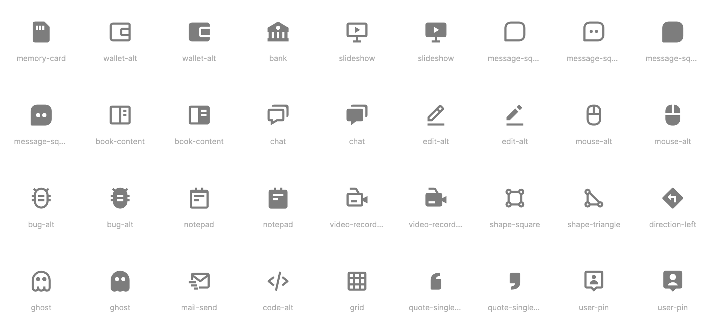

# Boxicons for Flutter

[Boxicons](https://boxicons.com) for Flutter, a carefully designed open source iconset with 1500+ icons.

## Features



[Boxicons](https://boxicons.com) are 1500+ simple open-source icons carefully crafted for designers & developers.

For a full list of icons, have a look at the [Boxicons](https://boxicons.com) website.

There are 3 types of icons:

- Regular
- Solid
- Logos

## Usage

```
dependencies:
  cupertino_icons: ^<latest-version>
```

```
...
bottomNavigationBar: BottomNavigationBar(
    ...,
    items: const [
        BottomNavigationBarItem(
            label: "Explore",
            icon: Icon(BoxIcons.compass_regular),
        ),
        BottomNavigationBarItem(
            label: "Favorites",
            icon: Icon(BoxIcons.star_regular),
        ),
        BottomNavigationBarItem(
            label: "About",
            icon: Icon(BoxIcons.info_circle_regular),
        ),
    ],
),
...
```

Each icon name has a suffix that describes its type:

- `_regular` for Regular icons
- `_solid` for Solid icons
- `_logo` for Logos

## Additional information

Package created by [@albemala](https://github.com/albemala) ([Twitter](https://twitter.com/albemala))

Icons created by [atisawd](https://github.com/atisawd)

Both package and icons are licensed under
the [MIT License](https://github.com/albemala/boxicons-flutter/blob/main/LICENSE)
